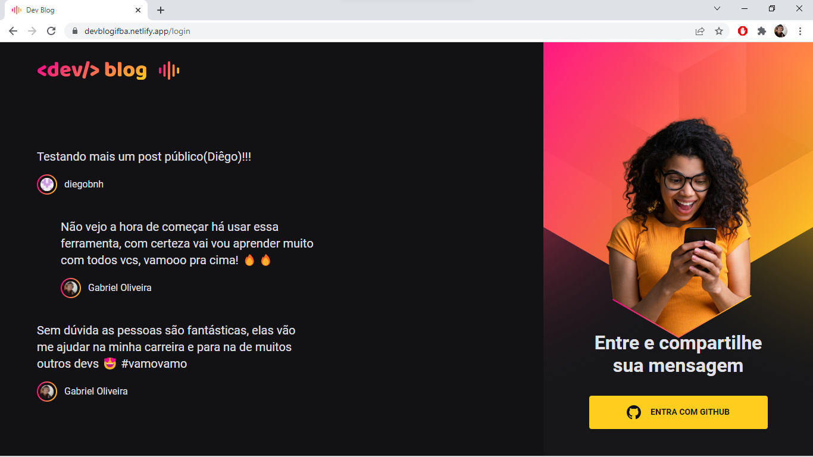
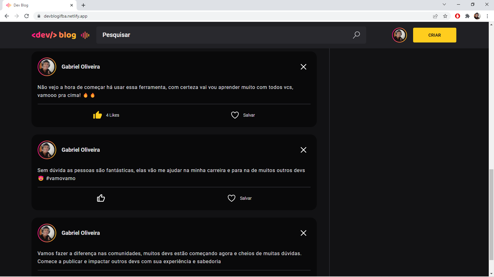
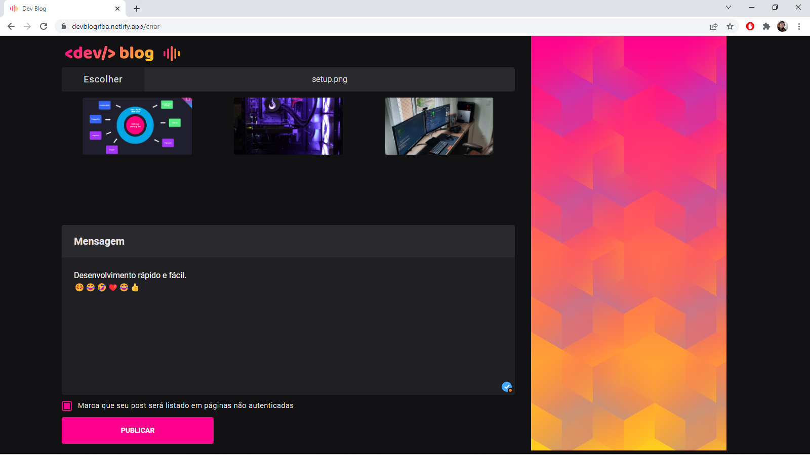
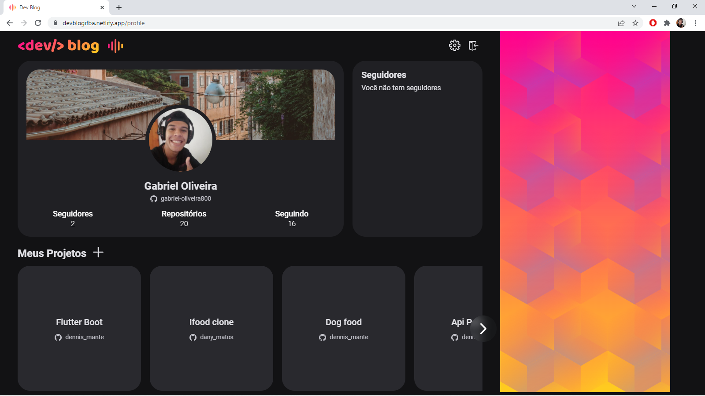
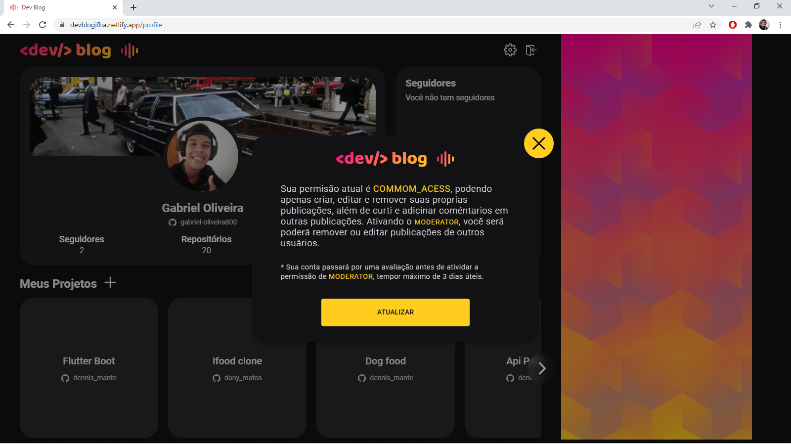

# Dev Blog

Este é um projeto desenvolvido para uma disciplina de desenvolvimento web, como avaliação do
quinto semestre da faculdade, o objetivo da atividade era criar um aplicativo que atendesse
os requisitos da atividade, então criei um pequeno blog jutamente com uma [ApiRest ](https://github.com/gabriel-oliveira800/dev-blog-api) para o mesmo.

# Tecnologias

- [Heroku](https://devcenter.heroku.com/)
- [Vite](https://vitejs.dev/guide/) - React
- [SASS](https://sass-lang.com/documentation)
- [TypeScritp](https://www.typescriptlang.org/)
- [Netlify](https://docs.netlify.com/?_ga=2.132446414.1710896130.1645274473-1385395914.1645274473)
- [GitUbOAuth2.0](https://docs.github.com/pt/developers/apps/building-oauth-apps/authorizing-oauth-apps)

# Features

- Authenticação com Github
- Acesso para diferentes usuários
- Criação de publicação - CRUD
- Upload de arquivos
- Favoritos

# Site

  <video width="100%" controls>
    <source src="screenshots/demo.webm" type="video/webm">
    Your browser does not support the video tag.
  </video>

  
  
  
  
  

